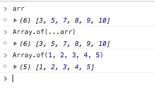

---

categories:
    - name: javascript
mediaUrl: https://web-1251777767.cos.ap-chongqing.myqcloud.com/2018-07-31/cate/JavaScript-Array-logo.png
title: Javascript 关于array的使用

---


# Javascript 关于array的使用

最近做项目经常会使用到数组，尤其在一个中台系统中，数组是尤为常见的，而且前端数组可以实现任何有序数据结构，总结一下数组的方方面面。

## 使用

### 创建数组

```js
const arr = [] // 直接申明
const arr1 = new Array() // 使用示例构建
const arr2 = Array()
const arr3 = Array.of(1, 2) // 从多个参数直接构建一个Array
const arr4 = Array.from(likeArr) // 从一个类数组中创建一个数组
```
上面可以使用Array.from 进行数组深复制。关于深复制详见其他博文

## 方法

> 数组简单用法
### array 方法的callback 参数

翻译说: 传入一个回调函数callback, callback 里面有三个参数当前遍历的元素element, 当前元素的坐标index, 以及遍历的数组array. 还有一个可选参数，在find里面使用this就是这个值thisArg如果未传入，则是根据当前执行环境获取this。


### Array.prototype.find

#### 用法

```js
const a = [1, 2, 4]
const value = a.find(current => current > 3)
console.log(value) // 4
```

#### 参数

参数看callback参数,返回结果数组中的符合条件的值,如果是对象则返回对象引用。

> 返回一个array中的值，如果是对象或者数组则返回引用，直接修改会改动数组中的值

### Array.prototype.forEach

遍历这个数组，但是在forEach中不可以使用break、continue继续中断后续循环, 如果使用return 后将不再执行return后的语句，也不影响forEach的循环如下图:


### Array.prototype.slice

复制数组,可以继续数组浅拷贝(深拷贝和浅拷贝关注后续)

slice 会复制最外层,相似的比如 

使用对象展开符号`...`

slice 传入两个可选参数`begin`和 `end`，返回一个新的数组。如下：


> 返回一个新数组可以进行数组的链式操作

### Array.prototype.concat

连接一个数组或者多个值:


连接一个数组:


> 返回一个新数组，可以进行数组的链式操作

### Array.prototype.from

通过已存在数组进行浅拷贝或者一个类数组的对象转化成数组:


类数组转化:
最明显的类数组，例如查询页面dom:

现在是NodeList，转化成数组:


这样就可以使用所有的数组操作

> 返回的是数组就可以链式使用方法了


### Array.prototype.push

将一个值推入到数组的尾端，并返回新的数组长度。


### Array.prototype.pop

将一个值从数组的尾端移除，并返回移除数组中的那个值.


pop 是 push 的反操作。使用push和pop可以实现栈数据结构(先进后出)

### Array.prototype.shift

将一个数据从数组的头部移除。并返回移除的值


### Array.prototype.unshift

讲一个数据添加到数组的头部，并返回新数组的长度


使用shift和unshift 可以实现队列的数据结构(先进先出)


### Array.prototype.indexOf

获取数组中某个值的坐标，只能是字面量变量数组，不适用多维数组和多对象数组


有一个可选参数fromIndex，从fromIndex可是搜索


> 数组进阶操作

### Array.prototype.map

传入一个回调函数，会对数组每个参数执行callback:


> polyfill(mdn)

```js
// Production steps of ECMA-262, Edition 5, 15.4.4.19
// Reference: http://es5.github.io/#x15.4.4.19
if (!Array.prototype.map) {

  Array.prototype.map = function(callback/*, thisArg*/) {

    var T, A, k;

    if (this == null) {
      throw new TypeError('this is null or not defined');
    }

    // 1. Let O be the result of calling ToObject passing the |this| 
    //    value as the argument.
    var O = Object(this);

    // 2. Let lenValue be the result of calling the Get internal 
    //    method of O with the argument "length".
    // 3. Let len be ToUint32(lenValue).
    var len = O.length >>> 0;

    // 4. If IsCallable(callback) is false, throw a TypeError exception.
    // See: http://es5.github.com/#x9.11
    if (typeof callback !== 'function') {
      throw new TypeError(callback + ' is not a function');
    }

    // 5. If thisArg was supplied, let T be thisArg; else let T be undefined.
    if (arguments.length > 1) {
      T = arguments[1];
    }

    // 6. Let A be a new array created as if by the expression new Array(len) 
    //    where Array is the standard built-in constructor with that name and 
    //    len is the value of len.
    A = new Array(len);

    // 7. Let k be 0
    k = 0;

    // 8. Repeat, while k < len
    while (k < len) {

      var kValue, mappedValue;

      // a. Let Pk be ToString(k).
      //   This is implicit for LHS operands of the in operator
      // b. Let kPresent be the result of calling the HasProperty internal 
      //    method of O with argument Pk.
      //   This step can be combined with c
      // c. If kPresent is true, then
      if (k in O) {

        // i. Let kValue be the result of calling the Get internal 
        //    method of O with argument Pk.
        kValue = O[k];

        // ii. Let mappedValue be the result of calling the Call internal 
        //     method of callback with T as the this value and argument 
        //     list containing kValue, k, and O.
        mappedValue = callback.call(T, kValue, k, O);

        // iii. Call the DefineOwnProperty internal method of A with arguments
        // Pk, Property Descriptor
        // { Value: mappedValue,
        //   Writable: true,
        //   Enumerable: true,
        //   Configurable: true },
        // and false.

        // In browsers that support Object.defineProperty, use the following:
        // Object.defineProperty(A, k, {
        //   value: mappedValue,
        //   writable: true,
        //   enumerable: true,
        //   configurable: true
        // });

        // For best browser support, use the following:
        A[k] = mappedValue;
      }
      // d. Increase k by 1.
      k++;
    }

    // 9. return A
    return A;
  };
}
```

### Array.prototype.reduce

需要两个参数，一个callback参数，一个累加初始值.
callback参数:

callback参数有三个累加的值acc, 当前值cv, 当前坐标cvIdx, 当前数组arr

用法:

求和:

返回值根据初始化的值来变化，可能是数组，对象，数字，字符串等等。

> polyfill(mdn)

```js
// Production steps of ECMA-262, Edition 5, 15.4.4.21
// Reference: http://es5.github.io/#x15.4.4.21
// https://tc39.github.io/ecma262/#sec-array.prototype.reduce
if (!Array.prototype.reduce) {
  Object.defineProperty(Array.prototype, 'reduce', {
    value: function(callback /*, initialValue*/) {
      if (this === null) {
        throw new TypeError( 'Array.prototype.reduce ' + 
          'called on null or undefined' );
      }
      if (typeof callback !== 'function') {
        throw new TypeError( callback +
          ' is not a function');
      }

      // 1. Let O be ? ToObject(this value).
      var o = Object(this);

      // 2. Let len be ? ToLength(? Get(O, "length")).
      var len = o.length >>> 0; 

      // Steps 3, 4, 5, 6, 7      
      var k = 0; 
      var value;

      if (arguments.length >= 2) {
        value = arguments[1];
      } else {
        while (k < len && !(k in o)) {
          k++; 
        }

        // 3. If len is 0 and initialValue is not present,
        //    throw a TypeError exception.
        if (k >= len) {
          throw new TypeError( 'Reduce of empty array ' +
            'with no initial value' );
        }
        value = o[k++];
      }

      // 8. Repeat, while k < len
      while (k < len) {
        // a. Let Pk be ! ToString(k).
        // b. Let kPresent be ? HasProperty(O, Pk).
        // c. If kPresent is true, then
        //    i.  Let kValue be ? Get(O, Pk).
        //    ii. Let accumulator be ? Call(
        //          callbackfn, undefined,
        //          « accumulator, kValue, k, O »).
        if (k in o) {
          value = callback(value, o[k], k, o);
        }

        // d. Increase k by 1.      
        k++;
      }

      // 9. Return accumulator.
      return value;
    }
  });
}
```

### Array.prototype.fill

对数组继续填充，传入三个变量, 填充值value, 填充开始位置start, 填充结束位置end


返回修改后的数组可以继续操作

> polyfill(来自mdn)

```js
if (!Array.prototype.fill) {
  Object.defineProperty(Array.prototype, 'fill', {
    value: function(value) {

      // Steps 1-2.
      if (this == null) {
        throw new TypeError('this is null or not defined');
      }

      var O = Object(this);

      // Steps 3-5.
      var len = O.length >>> 0;

      // Steps 6-7.
      var start = arguments[1];
      var relativeStart = start >> 0;

      // Step 8.
      var k = relativeStart < 0 ?
        Math.max(len + relativeStart, 0) :
        Math.min(relativeStart, len);

      // Steps 9-10.
      var end = arguments[2];
      var relativeEnd = end === undefined ?
        len : end >> 0;

      // Step 11.
      var final = relativeEnd < 0 ?
        Math.max(len + relativeEnd, 0) :
        Math.min(relativeEnd, len);

      // Step 12.
      while (k < final) {
        O[k] = value;
        k++;
      }

      // Step 13.
      return O;
    }
  });
}
```

### Array.prototype.some
判断是否存在满足回调函数返回的条件，回调函数条件如上callback 参数,返回值是true/false


> polyfill(mdn)


```js
if (!Array.prototype.some) {
  Array.prototype.some = function(fun/*, thisArg*/) {
    'use strict';

    if (this == null) {
      throw new TypeError('Array.prototype.some called on null or undefined');
    }

    if (typeof fun !== 'function') {
      throw new TypeError();
    }

    var t = Object(this);
    var len = t.length >>> 0;

    var thisArg = arguments.length >= 2 ? arguments[1] : void 0;
    for (var i = 0; i < len; i++) {
      if (i in t && fun.call(thisArg, t[i], i, t)) {
        return true;
      }
    }

    return false;
  };
}
```

### Array.prototype.every
判断数组中每一个是否满足回调函数满足的条件,返回true/false


> polyfill(mdn)

```js
if (!Array.prototype.every) {
  Array.prototype.every = function(callbackfn, thisArg) {
    'use strict';
    var T, k;

    if (this == null) {
      throw new TypeError('this is null or not defined');
    }

    // 1. Let O be the result of calling ToObject passing the this 
    //    value as the argument.
    var O = Object(this);

    // 2. Let lenValue be the result of calling the Get internal method
    //    of O with the argument "length".
    // 3. Let len be ToUint32(lenValue).
    var len = O.length >>> 0;

    // 4. If IsCallable(callbackfn) is false, throw a TypeError exception.
    if (typeof callbackfn !== 'function') {
      throw new TypeError();
    }

    // 5. If thisArg was supplied, let T be thisArg; else let T be undefined.
    if (arguments.length > 1) {
      T = thisArg;
    }

    // 6. Let k be 0.
    k = 0;

    // 7. Repeat, while k < len
    while (k < len) {

      var kValue;

      // a. Let Pk be ToString(k).
      //   This is implicit for LHS operands of the in operator
      // b. Let kPresent be the result of calling the HasProperty internal 
      //    method of O with argument Pk.
      //   This step can be combined with c
      // c. If kPresent is true, then
      if (k in O) {

        // i. Let kValue be the result of calling the Get internal method
        //    of O with argument Pk.
        kValue = O[k];

        // ii. Let testResult be the result of calling the Call internal method
        //     of callbackfn with T as the this value and argument list 
        //     containing kValue, k, and O.
        var testResult = callbackfn.call(T, kValue, k, O);

        // iii. If ToBoolean(testResult) is false, return false.
        if (!testResult) {
          return false;
        }
      }
      k++;
    }
    return true;
  };
}
```

### Array.prototype.filter
过滤满足回调函数返回值的的数组，返回值是一个数组，如果没有满足的则是空数组:


> polyfill(mdn)

```js
if (!Array.prototype.filter) {
  Array.prototype.filter = function(fun/*, thisArg*/) {
    'use strict';

    if (this === void 0 || this === null) {
      throw new TypeError();
    }

    var t = Object(this);
    var len = t.length >>> 0;
    if (typeof fun !== 'function') {
      throw new TypeError();
    }

    var res = [];
    var thisArg = arguments.length >= 2 ? arguments[1] : void 0;
    for (var i = 0; i < len; i++) {
      if (i in t) {
        var val = t[i];

        // NOTE: Technically this should Object.defineProperty at
        //       the next index, as push can be affected by
        //       properties on Object.prototype and Array.prototype.
        //       But that method's new, and collisions should be
        //       rare, so use the more-compatible alternative.
        if (fun.call(thisArg, val, i, t)) {
          res.push(val);
        }
      }
    }

    return res;
  };
}
```

### Array.prototype.includes

数组中是否包含某个值:


> polyfill(mdn)

```js
// https://tc39.github.io/ecma262/#sec-array.prototype.includes
if (!Array.prototype.includes) {
  Object.defineProperty(Array.prototype, 'includes', {
    value: function(searchElement, fromIndex) {

      // 1. Let O be ? ToObject(this value).
      if (this == null) {
        throw new TypeError('"this" is null or not defined');
      }

      var o = Object(this);

      // 2. Let len be ? ToLength(? Get(O, "length")).
      var len = o.length >>> 0;

      // 3. If len is 0, return false.
      if (len === 0) {
        return false;
      }

      // 4. Let n be ? ToInteger(fromIndex).
      //    (If fromIndex is undefined, this step produces the value 0.)
      var n = fromIndex | 0;

      // 5. If n ≥ 0, then
      //  a. Let k be n.
      // 6. Else n < 0,
      //  a. Let k be len + n.
      //  b. If k < 0, let k be 0.
      var k = Math.max(n >= 0 ? n : len - Math.abs(n), 0);

      function sameValueZero(x, y) {
        return x === y || (typeof x === 'number' && typeof y === 'number' && isNaN(x) && isNaN(y));
      }

      // 7. Repeat, while k < len
      while (k < len) {
        // a. Let elementK be the result of ? Get(O, ! ToString(k)).
        // b. If SameValueZero(searchElement, elementK) is true, return true.
        // c. Increase k by 1. 
        if (sameValueZero(o[k], searchElement)) {
          return true;
        }
        k++;
      }

      // 8. Return false
      return false;
    }
  });
}
```

### Array.prototype.sort

根据回调函数进行排序，参数:


当什么都不传递的时候，则根据每个字符的Unicode的值

传入一个比较函数的时候:


这里描述几种情况:

- 如果函数返回小于0，排序前一个值a放到一个小的下标
- 如果函数返回返回0，则a和b的位置不变
- 返回值大于0,则排序的后一个值b放到小的下标
- 比较函数总是要返回相似的值，不一样的值导致返回的结果未必是预料的。


### Array.prototype.reverse

数组的反转,直接数组头尾交换:

更换后数组，和变换前数组是同一个对象，同sort函数。

### Array.of

传入多个变量，将其转换成新的数组:



## 一些数组变换操作

### 使用map

map 可以会数组中每个值进行相同函数操作，例如:
将一个变量中所有id取出来
```js
var persons = [ { id: 3 }, { id: 4 }]
const ids = persons.map(p => p.id)
```


### 使用reduce

## 链式操作

所谓链式操作，就是直接返回数组直接继续使用数组中方法，不熟悉不推荐使用，代码维护性下降
如下:
```js
const idsStr = persons.map(p => p.id).join(',') // 3,4(join返回字符串，可以继续使用字符串方法)
```

## 数组关于Promise的sao操作

看如下代码:

```js
Promise.all(ids.map(id => requestPersonById(id)).then(persons => {
    // persons 就是每个id请求的人
})
```


## 数组和Set的故事

去重操作:

```js
const arr = [...new Set(duplicateArr)]
```


