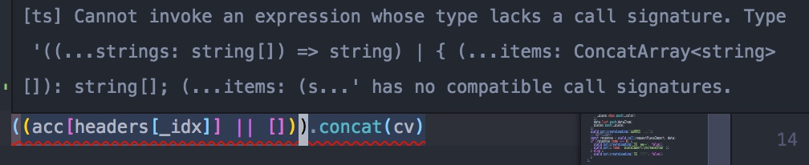
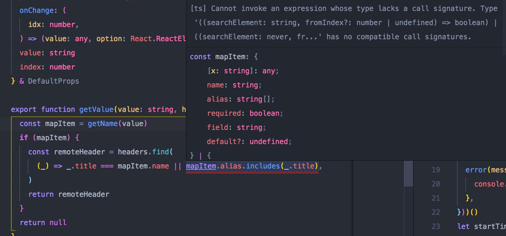

---

title: typescript 类型兼容问题[Cannot invoke an expression whose type lacks a call signature]
categories:
    - name: typescript
      img: https://cdn-cos.luoyangfu.com/2018-08-13/cate/ts-logo.jpg

---


# typescript 类型兼容问题[Cannot invoke an expression whose type lacks a call signature]

在stackflow找到的这个问题的答案：[stackflow](https://stackoverflow.com/questions/42427393/cannot-invoke-an-expression-whose-type-lacks-a-call-signature)

> TypeScript supports structural typing (also called duck typing), meaning that types are compatible when they share the same members.

附上官网类型兼容的链接: [https://www.typescriptlang.org/docs/handbook/type-compatibility.html](https://www.typescriptlang.org/docs/handbook/type-compatibility.html)

Type compatibility in TypeScript is based on structural subtyping. Structural typing is a way of relating types based solely on their members

这里说结构化类型是结构成员关联的一种方式。而ts的类型兼容就基于这种方式。所以发生这种问题原因在两周以上的类型成员没有共享，或者结构不同。

爆出这种错误:


这种错误:




还有stackflow上那种水果类型错误。

如何解决这种问题呢？

### 使用any类型

比如第二种，只需要这样:

```ts
const mapItem: any = getName(value) // 这样下面错误就pass了
```

### 将类型声明为一种类型

直接写`[]`的类型是`never[]`, 而`headers`的类型 `string[]`, 所以需要统一类型。

第一种
```ts
((acc[headers[_idx]] || []) as string[]).concat(cv)
```

### 第三种错误

第三种其实和第一种一样，不过第一种使用any 兼容其他类型，所以不会爆出这样的错误

详细见这个解决方案，稍后会有列子[stackflow](https://stackoverflow.com/questions/42427393/cannot-invoke-an-expression-whose-type-lacks-a-call-signature)


