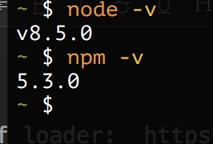
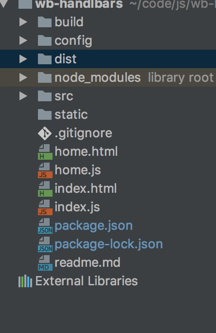
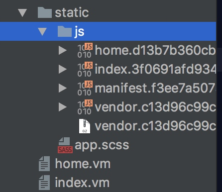
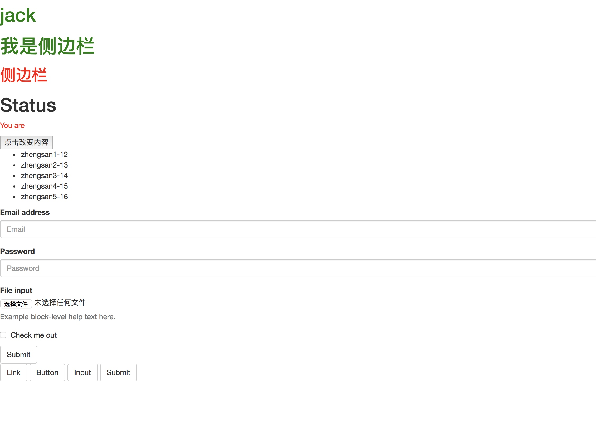

---

title: webpack+handlebars+jquery进行远古开发
categories:
    - name: webpack
    - name: javascript
description: webpack是在很久之前开发，因为volocity和handlebars语法一样，在一群Java的世界里，需要这样的工具能够使用这些，让Java可以和前端一起开发一起玩耍，然后就诞生这个，这个开发很就之前，使用webpack+jquery+handlebars，表格使用datatables, 样式使用admin-lte,最后效果不错，毕竟习惯了vue和react开发后, 所以不推荐这个。


---

# webpack的使用

## 预制工具:

sass/handlebar/jquery/booststrap/admin-lte/datatables，版本管理等

仓库: https://github.com/zsirfs/webpack-handlebars-template
issue: https://github.com/zsirfs/webpack-handlebars-template/issues


## 前言

自从webpack 诞生，就开启了webpack的时代，从其他的老大哥打包工具过度而来，详情可看: https://github.com/tstrilogy/webpack-handlebars-template

## 0. 资源
	
list of loader:  https://webpack.github.io/docs/list-of-loaders.html (关于webpack 所有资源的loader 列表) 
webpack doc: https://doc.webpack-china.org/ (webpack的中文文档)


## 1. 安装环境
	
本机安装环境:

    系统: macos
    nodejs: nodejs8.5
    npm: 5.3

	


上面是系统的搭建开发模板的系统环境。


## 2. 配置目录及文件

```json
{
  "name": "handlerbase-template",
  "version": "1.0.0",
  "description": "use handlebars",
  "author": "longfan.zheng",
  "private": true,
  "scripts": {
    "dev": "node build/dev.server.js",
    "build": "node build/build.js"
  },
  "dependencies": {
    "bootstrap": "^3.3.7",  
    "jquery": "^3.2.1"
  },
  "devDependencies": {
    "autoprefixer": "^6.7.2",
    "babel-core": "^6.22.1",
    "babel-loader": "^6.2.10",
    "babel-plugin-transform-runtime": "^6.22.0",
    "babel-preset-env": "^1.2.1",
    "babel-preset-stage-2": "^6.22.0",
    "babel-register": "^6.22.0",
    "chalk": "^1.1.3",
    "compression-webpack-plugin": "^1.0.0",
    "connect-history-api-fallback": "^1.3.0",
    "copy-webpack-plugin": "^4.0.1",
    "css-loader": "^0.26.1",
    "eslint-friendly-formatter": "^3.0.0",
    "eventsource-polyfill": "^0.9.6",
    "express": "^4.14.1",
    "extract-text-webpack-plugin": "^2.0.0",
    "file-loader": "^0.10.0",
    "friendly-errors-webpack-plugin": "^1.1.3",
    "function-bind": "^1.1.0",
    "handlebars": "^4.0.10",
    "handlebars-loader": "^1.6.0",
    "handlebars-template-loader": "^0.8.0",
    "html-webpack-plugin": "^2.28.0",
    "http-proxy-middleware": "^0.17.3",
    "node-sass": "^4.5.3",
    "opn": "^4.0.2",
    "optimize-css-assets-webpack-plugin": "^1.3.0",
    "ora": "^1.1.0",
    "rimraf": "^2.6.0",
    "sass-loader": "^6.0.6",
    "semver": "^5.3.0",
    "style-loader": "^0.18.2",
    "url-loader": "^0.5.7",
    "webpack": "^2.2.1",
    "webpack-bundle-analyzer": "^2.9.0",
    "webpack-dev-middleware": "^1.10.0",
    "webpack-hot-middleware": "^2.16.1",
    "webpack-merge": "^2.6.1"
  },
  "engines": {
    "node": ">= 4.0.0",
    "npm": ">= 3.0.0"
  },
  "browserslist": [
    "> 1%",
    "last 2 versions",
    "not ie <= 8"
  ]
}

```
上面是关于开发环境的`package.json`的基本内容，关于依赖就是jquery,bootstrap.其他的开发依赖等待稍后配置说明.

## 3. 详细配置

### 根据`package.json`进行安装:

```bash
$ npm install 

```
或者

```bash
$ yarn 

```

安装好配置准备如下目录:




### 目录说明以及文件说明：

    |- build   脚本文件位置
    |- config  配置文件
    |- dist  打包后的文件
    |- node_modules  node模块
    |- src 源码文件
    |- static  静态资源(这个是直接复制到打包目录的)
    |- .gitignore git忽略文件目录
    |- home.html 普通html文件
    |- home.js  html入口js文件
    |- index.html  同上
    |- index.js 同上
    |- package.json 
    |- package-lock.json
    |- readme.md
 
文件目录配置如上说明如上。

### 配置文件的编写 在config 目录下。

#### 公共配置文件 index.js文件
    
```javascript
const path = require('path')
const fs = require('fs')
let htmls = fs.readdirSync(path.resolve(__dirname, '..'))
  .filter(cv => cv.endsWith('.html')) // 得到root目录下的所有html文件
const suffix = '.vm'  // 定义打包后的文件后缀
const files = {} // 定义输出文件的对象
htmls = htmls.map(function (html) {
  const name = html.split('.')[0]
  files[name] = path.resolve(__dirname, '../dist', name + suffix)
}) // 得到输出文件的名称以及路径
module.exports = {
  build: Object.assign({
    env: require('./prod.env'),
    assetsRoot: path.resolve(__dirname, '../dist'),
    assetsSubDirectory: 'static',  // 定义静态资源的子目录
    assetsPublicPath: '/', // 定义资源的路径
    productionSourceMap: true, // 定义产品环境开启sourceMap
    productionGzip: true, // 开启产品环境gzip 压缩
    productionGizpExtensions: ['js', 'css'], // 定义产品环境gzip压缩的后缀
    bundleAnlyzerReport: false //关闭打包后自动打开打包分析报告
  }, files), // 打包文件的内容
  dev: {
    env: require('./dev.env'),
    port: 8080, // 定义开发服务器的端口
    autoOpenBrowser: true, // 定义是否自动打开浏览器
    assetsSubDirectory: 'static', // 定义资源子目录和build的key 定义一样
    assetsPublicPath: '/', // 同上
    proxyTable: {}, // 代理配置
    cssSourceMap: false // 关闭cssSourceMap
  } // 开发配置项
}
```

> 说明: 最后打包出来的文件需要使用volcityjs模板引擎来进行服务器渲染，so 打包的文件最后的即为是xxx.vm文件。需要当前的nodejs 环境支持array.filter方法以及array.map方法 

#### 开发文件dev.env.js和prod.env.js 编写

dev.env.js

```javascript
const merge = require('webpack-merge') // webpack 配置文件合并的模块
const proEnv = require('./prod.env') // 请求产品环境的环境变量

module.exports = merge(proEnv, {
  NODE_ENV: '"development"'
}) // 覆盖NODE_ENV的值

```

prod.env.js

```javascript
module.exports = {
  NODE_ENV: '"production"'
} // 定义产品环境的NODE_ENV
```

上面就就定义好了开发的配置文件，主要是关于打包配置项以及开发配置项的定义。


### 开始编写build目录下的打包脚本以及webpack的配置文件。

#### webpack 配置文件

webpack.base.conf.js （基本的webpack 配置文件）

```javascript
const path = require('path')
const config = require('../config') // 获取index.js
const fs = require('fs')
const webpack = require('webpack')

function resolve (dir) {
  return path.join(__dirname, '..', dir)
} // 解析根目录的方法，返回一个绝对路径

function assetsPath (_path) {
  var assetsSubDirectory = process.env.NODE_ENV === 'production'
    ? config.build.assetsSubDirectory
    : config.dev.assetsSubDirectory
  return path.posix.join(assetsSubDirectory, _path)
} // 通过当前NODE_ENV得到资源路径

const prefix = './' // 定义路径浅醉
let jsFiles = fs.readdirSync(path.resolve(__dirname, '..'))
  .filter(function (cv) {
    return cv.endsWith('.js')
  }) // 得到入口文件，在根目录的js的文件，该项目中就是home.js和index.js
let entries = {}
jsFiles.map(function (cv) {
  const name = cv.split('.')[0]
  entries[name] = prefix + cv
  return cv
}) // 得到一个{ 'home': 'home.js', ...}这样的对象

module.exports = {
  entry: entries, // 配置入口文件
  output: {
    path: config.build.assetsRoot,
    filename: '[name].js',
    publicPath: process.env.NODE_ENV === 'production'
      ? config.build.assetsPublicPath
      : config.dev.assetsPublicPath
  }, // 配置输出
  resolve: {
    extensions: ['.js', '.hbs', '.json'],
    alias: {}
  }, // 配置require.resolve的解析，可以直接使用require('main.js')或者require('main.hbs')或者require('main.json')都可以省略后缀
  devtool: 'source-map',
  module: {
    rules: [ // 配置loader
      {
        test: /\.js$/,
        loader: 'eslint-loader',
        enforce: 'pre',
        include: [resolve('src')],
        options: {
          formatter: require('eslint-friendly-formatter')
        }
      },
      { 
        test: /\.hbs$/, // 在这里配置了hbs后缀的文件解析。
        loader: 'handlebars-loader',
        query: {}
      },
      {
        test: /\.js$/,
        loader: 'babel-loader',
        include: [resolve('src')]
      },
      {
        test: /\.(png|jpe?g|gif|svg)(\?.*)?$/,
        loader: 'url-loader',
        options: {
          limit: 10000,
          name: assetsPath('img/[name].[hash:7].[ext]')
        }
      },
      {
        test: /\.(mp4|webm|ogg|mp3|wav|flac|aac)(\?.*)?$/,
        loader: 'url-loader',
        options: {
          limit: 10000,
          name: assetsPath('media/[name].[hash:7].[ext]')
        }
      },
      {
        test: /\.(woff2?|eot|ttf|otf)(\?.*)?$/,
        loader: 'url-loader',
        options: {
          limit: 10000,
          name: assetsPath('fonts/[name].[hash:7].[ext]')
        }
      },
      {
        test: /\.(css|scss)$/, // 这里配置sass的解析。
        use: [
          {
            loader: 'style-loader'
          },
          {
            loader: 'css-loader',
            options: {
              sourceMap: true
            }
          },
          {
            loader: 'sass-loader',
            options: {
              sourceMap: true
            }
          }
        ]
      }
    ]
  },
  plugins: [
    new webpack.ProvidePlugin({
      $: 'jquery',
      jQuery: 'jquery'
    })
  ] // 这里定义了jquery可以直接在整个项目中使用$或者jQuery，不需要定义
}

```

webpack.dev.conf.js

```javascript
const webpack = require('webpack')
const path = require('path')
const merge = require('webpack-merge')
const config = require('../config')
const baseWebpackConfig = require('./webpack.base.conf') // 导入base
const HtmlWebpackPlugin = require('html-webpack-plugin') // 导入html 解析的webpack的插件
const FriendlyErrorsPlugin = require('friendly-errors-webpack-plugin') // 导入友好的错误提示的插件
const fs = require('fs')

Object.keys(baseWebpackConfig.entry).forEach(function (name) {
  baseWebpackConfig.entry[name] = ['./build/dev.client'].concat(
    baseWebpackConfig.entry[name])
}) // 自动读取在根目录下的html文件，并使用webpack的插件进行解析

let htmls = fs.readdirSync(path.resolve(__dirname, '..'))
  .filter(cv => cv.endsWith('.html')) 
const prefix = './'
htmls = htmls.map(function (html) {
  return new HtmlWebpackPlugin({
    filename: prefix + html,
    template: prefix + html,
    inject: true,
    chunks: [html.split('.')[0]]
  })
}) // 得到一个HtmlWebpackPlugin 的对象，具体配置看webpack-html-plugin主页

module.exports = merge(baseWebpackConfig, {
  devtool: '#cheap-module-eval-source-map',
  plugins: [
    new webpack.DefinePlugin({
      'process.env': config.dev.env
    }),
    new webpack.HotModuleReplacementPlugin(),
    new webpack.NoEmitOnErrorsPlugin(),
    new FriendlyErrorsPlugin()
  ].concat(htmls)
}) // 通过webpack-merge 合并配置文件
```

webpack.prod.conf.js

```javascript
const path = require('path')
const webpack = require('webpack')
const config = require('../config')
const merge = require('webpack-merge')
const baseWebpackConfig = require('./webpack.base.conf')
const CopyWebpackPlugin = require('copy-webpack-plugin')
const HtmlWebpackPlugin = require('html-webpack-plugin')
const ExtractTextPlugin = require('extract-text-webpack-plugin')
const OptimizeCssPlugin = require('optimize-css-assets-webpack-plugin')
const fs = require('fs')

const env = process.env.NODE_ENV === 'testing'
  ? require('../config/test.env')
  : config.build.env

function assetsPath (_path) {
  var assetsSubDirectory = process.env.NODE_ENV === 'production'
    ? config.build.assetsSubDirectory
    : config.dev.assetsSubDirectory
  return path.posix.join(assetsSubDirectory, _path)
}

let htmls = fs.readdirSync(path.resolve(__dirname, '..'))
  .filter(cv => cv.endsWith('.html'))
const prefix = './'
htmls = htmls.map(function (html) {
  const name = html.split('.')[0]
  return new HtmlWebpackPlugin({
    filename: config.build[name],
    template: prefix + html,
    inject: true,
    chunks: [name, 'vendor', 'manifest'],
    minify: {
      removeComments: true,
      collapseWhitespace: true,
      removeAttributeQuotes: true
    },
    chunksSortMode: 'dependency'
  })
})

const webpackConfig = merge(baseWebpackConfig, {
  devtool: config.build.productionSourceMap ? '#source-map' : false,
  output: {
    path: config.build.assetsRoot,
    filename: assetsPath('js/[name].[chunkhash].js'),
    chunkFilename: assetsPath('js/[id].[chunkhash].js')
  },
  plugins: [
    new webpack.DefinePlugin({
      'process.env': env
    }),
    new webpack.optimize.UglifyJsPlugin({
      compress: {
        warnings: false
      },
      sourceMap: true
    }),

    new webpack.optimize.CommonsChunkPlugin({
      name: 'vendor',
      minChunks: function (module, count) {
        return ( module.resource &&
          /\.js$/.test(module.resource) &&
          module.resource.indexOf(
            path.join(__dirname, '../node_modules')
          ) === 0)
      }
    }),
    new webpack.optimize.CommonsChunkPlugin({
      name: 'manifest',
      chunks: ['vendor']
    }),
    new CopyWebpackPlugin([
      {
        from: path.resolve(__dirname, '../static'),
        to: config.build.assetsSubDirectory,
        ignore: ['.*']
      }
    ])
  ].concat(htmls)
})

if (config.build.productionGzip) {
  const CompressionWebpackPlugin = require('compression-webpack-plugin')

  webpackConfig.plugins.push(
    new CompressionWebpackPlugin({
      asset: '[path].gz[query]',
      algorithm: 'gzip',
      test: new RegExp((
        '\\.(' + config.build.productionGizpExtensions.join('|') + ')$'
      )),
      threshold: 10240,
      minRatio: 0.8
    })
  )
}

if (config.build.bundleAnlyzerReport) {
  const BundleAnalyzerPlugin = require(
    'webpack-bundle-analyzer').BundleAnalyzerPlugin
  webpackConfig.plugins.push(new BundleAnalyzerPlugin())
}

module.exports = webpackConfig

```

> 开发环境的打包文件主要是开启压缩功能，可以将node_modules的文件打包一个文件，以及开启压缩等等.

编写开发服务器脚本

```javascript
const config = require('../config')
if (!process.env.NODE_ENV) {
  process.env.NODE_ENV = JSON.parse(config.dev.env.NODE_ENV)
}

const opn = require('opn')
const path = require('path')
const express = require('express')
const webpack = require('webpack')
const proxyMiddleware = require('http-proxy-middleware')
const webpackConfig = process.env.NODE_ENV === 'testing' ? require(
  './webpack.prod.conf') : require('./webpack.dev.conf')

const port = process.env.PORT || config.dev.port
const autoOpenBrowser = !!config.dev.autoOpenBrowser
const proxyTable = config.dev.proxyTable

const app = express()
const complier = webpack(webpackConfig)

const devMiddleware = require('webpack-dev-middleware')(complier, {
  publicPath: webpackConfig.output.publicPath,
  quiet: true,
  noInfo: false
}) // 开启开发中间件
const hotMiddleware = require('webpack-hot-middleware')(complier, {
  log: () => console.log,
  heartbeat: 2000
}) // 开启热更新

complier.plugin('compilation', function (compilation) {
  compilation.plugin('html-webpack-plugin-after-emit', function (data, cb) {
    hotMiddleware.publish({action: 'reloadd'})
    cb()
  })
})
Object.keys(proxyTable).forEach(function (context) {
  const options = proxyTable[context]
  if (typeof options === 'string') {
    options = {target: options}
  }
  app.use(proxyMiddleware(options.filter || context, options))
})

app.use(require('connect-history-api-fallback')()) // 拦截get请求
app.use(devMiddleware)
app.use(hotMiddleware)

const staticPath = path.posix.join(config.dev.assetsPublicPath,
  config.dev.assetsSubDirectory)
app.use(staticPath, express.static('./static')) // 设置静态资源目录和上诉config目录中配置一样

const uri = 'http://localhost:' + port

let _resolve
const readyPromise = new Promise(resolve => {
  _resolve = resolve
})
console.log('> Starting dev server...')
devMiddleware.waitUntilValid(() => {
  console.log('> Listening at ' + uri + '\n')
  if (autoOpenBrowser && process.env.NODE_ENV !== 'test') {
    opn(uri)
  }
  _resolve()
})

const server = app.listen(port)

module.exports = {
  ready: readyPromise,
  close: () => {
    server.close()
  }
}

```

编写客户端热更新模块：

```javascript
require('eventsource-polyfill')
const hotClient = require(
  'webpack-hot-middleware/client?noInfo=true&reload=true')

hotClient.subscribe(function (event) {
  // console.log('[hot client]', event.action)
  if (event.action === 'reload') {
    window.loaction.reload()
  }
})

```

> 这里主要是使用webpack-hot-middleware的语法，然后根据监听时间刷新页面

编写打包脚本build.js

```javascript
process.env.NODE_ENV = 'production'

const ora = require('ora')  // 控制台的等待的控制器
const rm = require('rimraf') // 删除文件
const path = require('path')
const chalk = require('chalk') // 控制台有颜色输出
const webpack = require('webpack')
const config = require('../config')
const webpackConfig = require('./webpack.prod.conf')

const spinner = ora('building for production...')
spinner.start()

rm(path.join(config.build.assetsRoot, config.build.assetsSubDirectory),
  function (err) {
    if (err) throw err
    webpack(webpackConfig, function (err, stats) {
      spinner.stop()
      if (err) throw err
      process.stdout.write(stats.toString({
        colors: true,
        modules: false,
        children: false,
        chunks: false,
        chunkModules: false
      }) + '\n\n')
      console.log(chalk.cyan('  Build complete.\n'))
      console.log(chalk.yellow(
        '  Tip: built files are meant to be served over an HTTP server.\n' +
        '  Opening index.html over file:// won\'t work.\n'
      ))
    })
  })
```
详细请看源码注释以及文件后面的备注. 源码请移步: https://github.com/tstrilogy/webpack-handlebars-template（欢迎提issue和点star）

## 4. 完成效果

打包后生成的文件:




显示效果:



都可以写出hbs文件重复使用.


## 5. 扩展

webpack是一个强大的打包工具，上面的配置文件是依据vue-webpack的配置文件，去除了vue的，改写成一个仅仅使用handlebars和jquery以及bootstrap的开发模板。当然可以根据其他的解析loader搭建不同开发环境，都是很容易的。

本文完.

